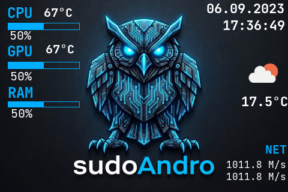
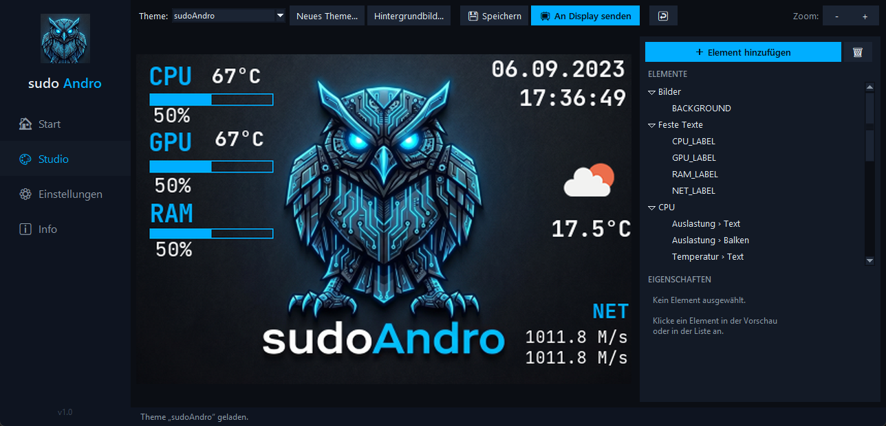

# 3,5″ Hardware-Monitoring · sudoAndro Studio

**Deutsche Komplettlösung für die günstigen 3,5-Zoll-USB-Sensordisplays** (Turing Smart Screen Rev. A
und baugleiche Temu/AliExpress-Klone, oft „UsbPCMonitor" genannt) — mit grafischem Drag-&-Drop-Editor,
aktueller Sensorik (CPU-/GPU-Temperatur, RAM, Netzwerk, **Wetter mit Symbolen**) und echtem
Display-Aus beim Abmelden/Herunterfahren.

*English summary below.*



## ✨ Was kann es?

- **sudoAndro Studio** — eine Steuerzentrale im dunklen Design:
  - 🏠 **Start:** Monitor starten/stoppen, Theme mit Vorschau wechseln
  - 🎨 **Studio:** Themes per **Drag & Drop** gestalten — Elemente anklicken, verschieben,
    Farben/Schriften per Klick ändern, über 30 Sensoren als Text, Balken, Ring oder Verlaufsgraph
  - ⚙️ **Einstellungen:** Helligkeit, COM-Port, Wetter — ohne eine Konfigurationsdatei anzufassen
- **Wetter inklusive Symbolen** ☀️🌧️ über die **kostenlose** OpenWeatherMap-API (kein Abo nötig)
- **Autostart** bei der Windows-Anmeldung (mit Adminrechten für die volle Sensorik — ohne UAC-Popup)
- **Display geht wirklich aus** beim Abmelden und Herunterfahren — auch bei Klonen, die den
  offiziellen Ausschaltbefehl ignorieren, und auch wenn die USB-Ports bestromt bleiben
- **Selbstheilung:** hängengebliebene Displays werden beim Start automatisch zurückgesetzt



## 🖥️ Unterstützte Hardware

| Gerät | Erkennung |
|---|---|
| Turing Smart Screen 3,5″ (Rev. A) | USB-Seriennummer `USB35INCHIPSV2` |
| Temu/AliExpress-Klone („UsbPCMonitor" 3,5″) | USB `VID 1A86 / PID 5722` (CH340) |

Windows 10/11. Für CPU-Temperatur & Co. wird LibreHardwareMonitor mit dem HVCI-kompatiblen
**PawnIO**-Treiber genutzt — die Windows-Speicher-Integrität kann **eingeschaltet bleiben**.

## 🚀 Installation

1. **Python 3.9+** installieren (bei der Installation „Add to PATH" anhaken)
2. Dieses Repository herunterladen (grüner „Code"-Knopf → „Download ZIP") und entpacken
3. In einer Eingabeaufforderung im Projektordner:
   ```
   python -m venv .venv
   .venv\Scripts\pip install -r requirements.txt
   ```
4. **PawnIO-Treiber** installieren (einmalig, für die CPU-Temperatur):
   `external\PawnIO\PawnIO_setup.exe` → Installieren
5. **Autostart einrichten:** Rechtsklick auf `install\setup-tasks.ps1` → *Mit PowerShell ausführen*
   (UAC bestätigen). Das richtet zwei geplante Aufgaben ein:
   - `TuringSmartScreen` — startet den Monitor bei jeder Anmeldung
   - `TuringDisplayOff` — schaltet das Display bei Abmeldung/Herunterfahren aus
6. **Gestalten:** `Theme-Studio.bat` doppelklicken (oder die `sudoAndro-Studio.exe` aus den
   [Releases](../../releases)) — Theme wählen, Elemente anordnen, „📺 An Display senden"

Deinstallation: `install\remove-tasks.ps1` als Administrator ausführen.

## 🌤️ Wetter einrichten (optional)

1. Kostenloses Konto auf [openweathermap.org](https://openweathermap.org) → API-Key kopieren
   (Freischaltung dauert 10 Min. bis ~2 Std.)
2. Im Studio unter ⚙️ **Einstellungen**: Key + Koordinaten eintragen → Speichern & Neustart
3. Im 🎨 Studio „Wetter Symbol" und „Wetter Temperatur" hinzufügen

## 🛡️ „Mein Virenscanner meldet die EXE!"

Falscher Alarm — und leider normal: Die EXEs sind mit PyInstaller gebaut (Python + Bibliotheken in
einer Datei) und entpacken sich beim Start selbst. Diese Technik nutzen auch Schadprogramme, daher
schlagen Heuristiken vorsorglich an. Wer der EXE nicht traut, nutzt einfach die `.bat`-Dateien —
sie starten denselben Code direkt aus dem hier einsehbaren Quelltext. Die EXEs jedes Releases sind
zusätzlich mit einem VirusTotal-Link versehen.

## 🔧 Technische Details für Neugierige

Das serielle Protokoll der Rev.-A-Displays hat **kein Framing**: Wird der Monitor-Prozess mitten in
einem 6-Byte-Befehl oder einer Bildübertragung beendet (z. B. beim Abmelden durch den Windows-
Aufgabenplaner), bleibt der Display-Controller **byteversetzt** hängen und ignoriert fortan alle
Befehle — bis zum Reset. Dieses Projekt löst das mit einer „Entstopfungs-Sequenz": ein Null-Padding
größer als ein Vollbild schließt offene Bildübertragungen ab, danach wird der gewünschte Befehl in
**allen sechs möglichen Byte-Versätzen** gesendet. Zusätzlich ignorieren viele Klone den offiziellen
`SCREEN_OFF`-Befehl — sie werden stattdessen mit `TO_BLACK` (Inhalt schwärzen) plus Helligkeit 0
ausgeschaltet. Details in [`display-off.py`](display-off.py) und
[`library/lcd/lcd_comm_rev_a.py`](library/lcd/lcd_comm_rev_a.py).

## 🙏 Credits

- Basiert auf dem großartigen [turing-smart-screen-python](https://github.com/mathoudebine/turing-smart-screen-python)
  von @mathoudebine und Community (GPL-3.0) — [Original-README](docs/README-upstream.md)
- Sensorik: [LibreHardwareMonitor](https://github.com/LibreHardwareMonitor/LibreHardwareMonitor) + [PawnIO](https://pawnio.eu/)
- Wetterdaten: [OpenWeatherMap](https://openweathermap.org)
- sudoAndro-Theme & Idee: **Andrijan** 🦉

## 📄 Lizenz

[GPL-3.0](LICENSE) — frei nutzen, ändern und weitergeben, solange der Quellcode offen bleibt.

---

## 🇬🇧 English summary

German-language toolkit for cheap 3.5″ USB sensor displays (Turing Smart Screen rev. A and
Temu/AliExpress clones, VID 1A86/PID 5722): a dark-themed control center with a **drag-and-drop
theme editor** (30+ sensors as text/bars/rings/graphs), free OpenWeatherMap weather **with icons**,
admin autostart via Task Scheduler, and a watchdog that **really turns the display off** on
logoff/shutdown — including clones that ignore `SCREEN_OFF` (handled via `TO_BLACK` + brightness 0)
and recovery from the rev. A protocol's missing framing (zero-padding + sending commands in all six
byte alignments). Based on [turing-smart-screen-python](https://github.com/mathoudebine/turing-smart-screen-python) (GPL-3.0).
The UI is currently German; contributions for other languages are welcome!
